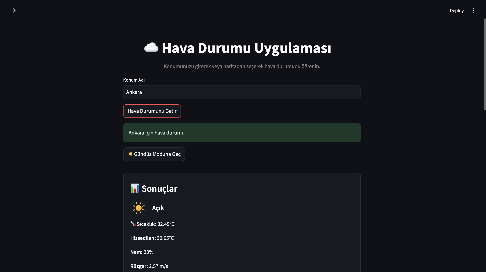
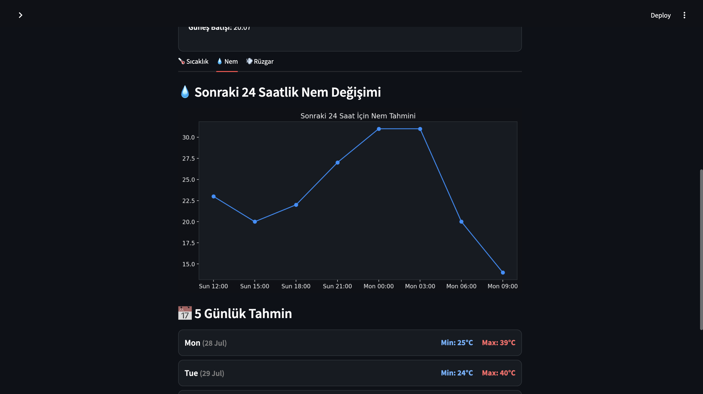
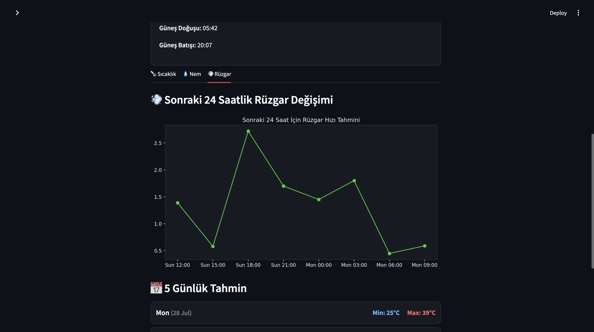
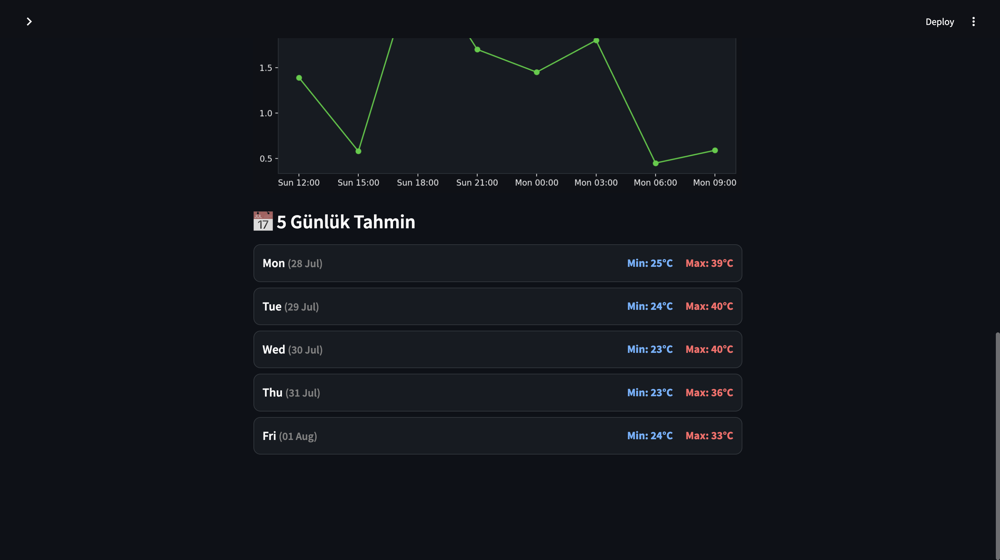
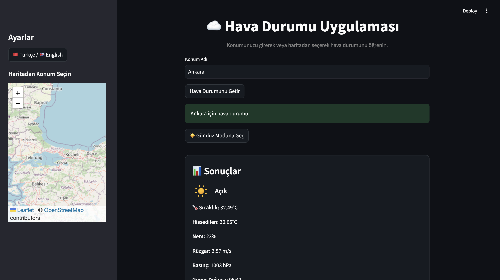
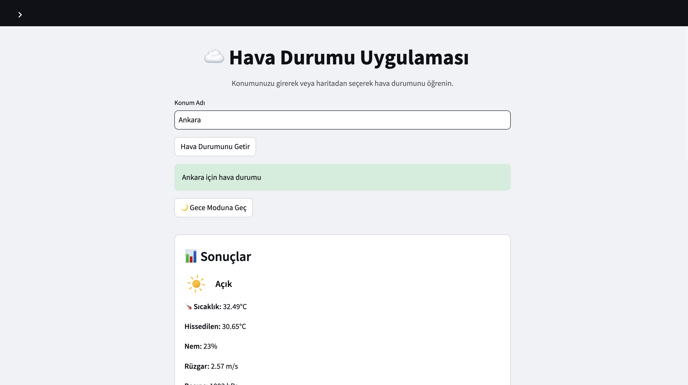

# 🌦️ Hava Durumu Uygulaması

📍 **Konumunuzu girerek, IP adresinizle veya harita üzerinden seçerek hava durumu bilgilerine ulaşın.**  
💡 Gündüz/Gece teması ve Türkçe/İngilizce dil desteğiyle modern ve kullanıcı dostu bir hava durumu deneyimi sunar.

## 🖼️ Uygulama Arayüzü

| Ana Ekran (Karanlık Tema) | Konum Girildikten Sonra | Detaylı Sonuçlar |
|---------------------------|-------------------------|------------------|
|       |     |  |

| 24 Saatlik Sıcaklık | Nem | Rüzgar |
|---------------------|-----|--------|
|  |  |  |

| 5 Günlük Tahmin | Harita Desteği | Aydınlık Tema |
|-----------------|----------------|----------------|
|  |  |  |

---

## ✨ Özellikler

- 📍 Şehir ismi, IP veya harita ile konum seçimi
- ⏰ 24 saatlik sıcaklık, nem ve rüzgar grafikleri
- 📅 5 günlük minimum-maksimum sıcaklık tahmini
- 🌗 Tema seçimi: Gündüz 🌞 / Gece 🌙
- 🌐 Dil desteği: Türkçe 🇹🇷 ve İngilizce 🇬🇧
- 🖼️ Hava durumuna ve saate göre dinamik ikonlar

---

## 🛠️ Kurulum

### 1. Depoyu Klonla

```bash
git clone https://github.com/kullaniciadi/weather-app.git
cd weather-app
```

### 2. Gereksinimleri Yükle

```bash
pip install -r requirements.txt
```

### 3. API Anahtarını Tanımla

- [OpenWeatherMap](https://openweathermap.org/api) adresinden ücretsiz API key al
- `.env` dosyası oluştur ve içine aşağıdaki satırı yaz:

```env
API_KEY="BURAYA_API_KEY_YAZ"
```

---

## 🚀 Uygulamayı Başlat

### Web arayüzü (Streamlit):

```bash
streamlit run weather_ui.py
```

### Komut satırı versiyonu:

```bash
python weather.py
```

---

## 📁 Proje Yapısı

```
weather-app/
├── .env
├── README.md
├── requirements.txt
├── translations.json
├── weather.py
├── weather_ui.py
├── icon/
│   ├── sun.svg
│   ├── moon.svg
│   ├── cloudy.svg
│   ├── rainy.svg
│   └── windy.svg
├── 1.png ~ 9.png 
```

---

## 🔒 Lisans

MIT License
